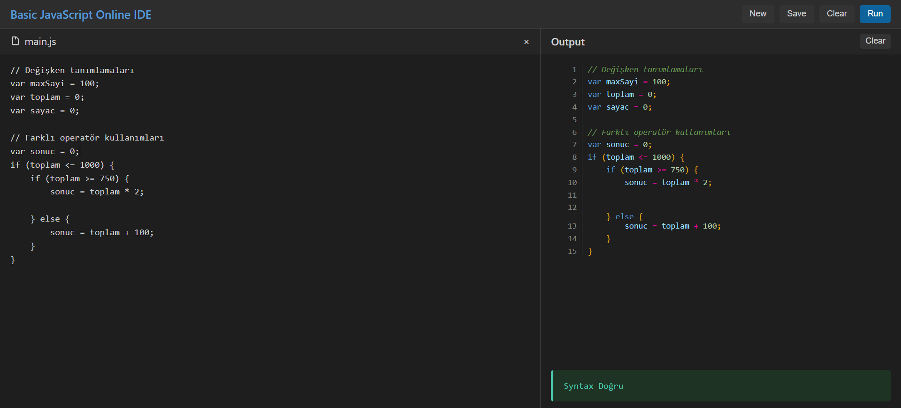
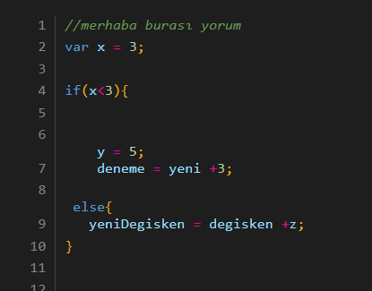
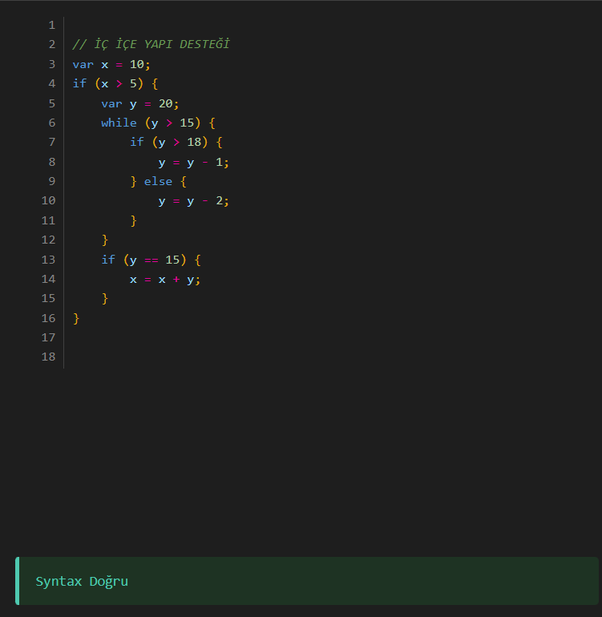
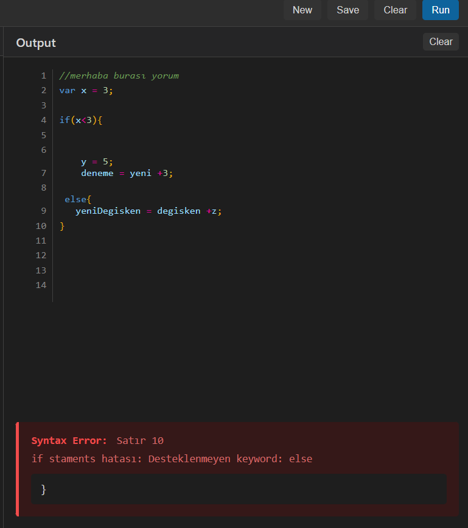

# Basic JavaScript syntax -Online Lexical ve Syntax Analyzer



## Proje Özeti
Bu proje, JavaScript benzeri bir dil için gerçek zamanlı sözdizimi renklendirici ve parser uygulamasıdır. Program, yazılan kodun sözdizimini analiz eder, hataları tespit eder ve kod bloklarını renklendirir.

## Projeye Ait Detaylı rapora bu linkten ulaşabilirsiniz
[DETAYLI MAKELE](https://medium.com/@bayoglumirac7/basic-javascript-syntax-online-lexical-ve-syntax-analyzer-442ab41f34a0)

## Projeyi Denemek İçin Linke Tıklayın
[Basic JavaScript]( https://miracbygl.github.io/BasicJavaScript_Highlighter/)
## Özellikler
- ✨ Gerçek zamanlı sözdizimi renklendirme
- 🔍 Anlık hata tespiti ve raporlama
- 📝 Satır  bazlı hata konumu gösterimi
- 🎨 8 farklı token tipi desteği
- 💬 Yorum satırı desteği

## Teknik Detaylar

### Lexical Analysis
- State Diagram yaklaşımı
- Regular Expressions 
- Token tipleri:
  - Keywords (if, else, while, var, vb.)
  - Identifiers
  - Numbers
  - Operators
  - Punctuation
  - Comments
  - Whitespace(Boşluklar)
  - Strings

### Parser
- Top-Down  Parser
- Desteklenen yapılar:
  - If-else statements
  - While loops
  - Variable declarations
  - Function calls
  - Expressions
  - Comments

### Formal Grammar
```bnf
program     := statement*
statement   := ifStmt | whileStmt | assignmentStmt | functionCall
ifStmt      := 'if' '(' expression ')' block ('else' block)?
whileStmt   := 'while' '(' expression ')' block
block       := '{' statement* '}'
expression  := term (('+' | '-') term)*
term        := factor (('*' | '/') factor)*
factor      := NUMBER | IDENTIFIER | '(' expression ')'
```

### Örnek Kullanım

### Yorum satırı desteği

 

 ### Farklı operatör ve iç içe yapı desteği

 

 ### Detaylı hata raporlama ve satır bazlı geri bildirim
 

 ## Hata Tespiti
Program aşağıdaki hata türlerini tespit edebilir:
- Sözdizimi hataları
- Eksik parantezler
- Geçersiz ifadeler
- Desteklenmeyen anahtar kelimeler
- Eksik noktalı virgülle

